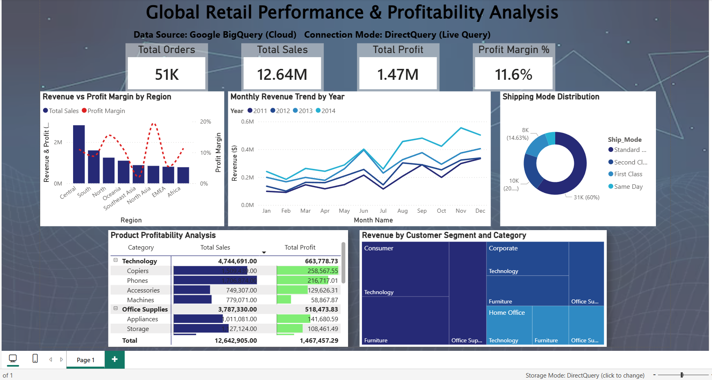
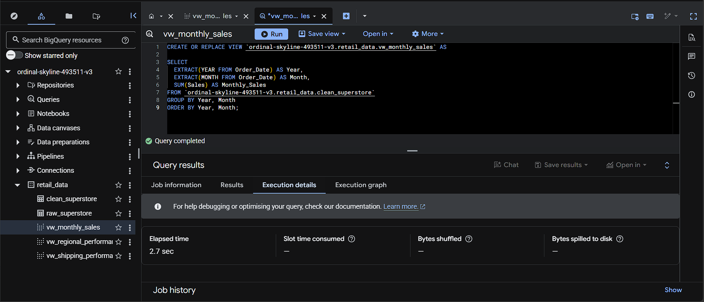

 Cloud Retail Analytics \& BI Pipeline (BigQuery + Power BI)

# Overview

This project demonstrates an end-to-end cloud analytics pipeline using Google BigQuery, SQL and Power BI.

# Architecture

 Data stored in Google BigQuery (cloud data warehouse)

 SQL used for transformation and business logic

 Power BI connected via DirectQuery (live queries)

 No local data storage used

# Dashboard Features

 KPI Tracking (Revenue, Profit, Orders, Margin)

 Regional Performance Analysis

 Monthly Revenue Trends

 Shipping Mode Analysis

 Product Profitability Matrix

 Customer Segmentation

# Key Insights

 High-margin regions identified despite lower sales

 Loss-making product categories detected

 Consumer segment drives majority revenue

 Technology category is top-performing

# Tech Stack

 Google BigQuery (SQL)

 Power BI (DirectQuery)

 Data Visualization

# Screenshots

## SQL View (BigQuery)

Author

Chrispin Joseph

